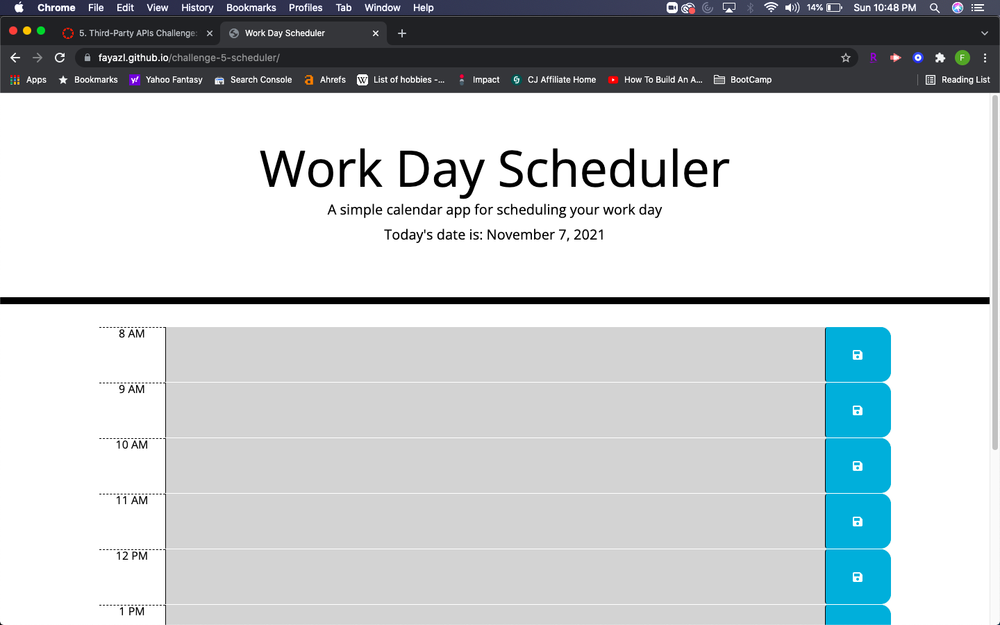

# Work Day Scheduler Starter Code

# For this project we have added new functionalities to existing code

# For those with busy schedules, this calendar will help track events in the day

# Once I load the page, I will be able to see time blocks for the past (gray), present (red), future (green)

# As I click in the box I will be able to type a description of my event

# Once I am done typing, I can click the save button enabling localStorage to save my input

# I will be able to revisit my input even after clicking refresh

# Here is a sample screenshot of my application

Repo Link: https://github.com/fayazl/challenge-5-scheduler

Live Pages Link: https://fayazl.github.io/challenge-5-scheduler/